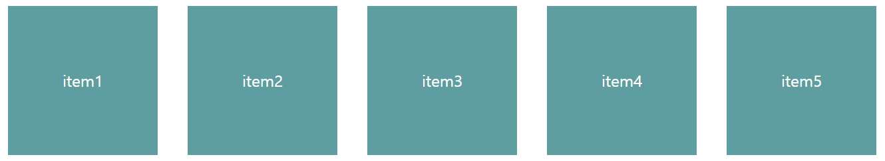

# 배치 및 레이아웃 관련 속성

- `position, left, right, top, bottom, z-index, float, clear` 등

# 1. position (위치)

- 현재 선택된 요소를 어떠한 방식으로 배치할지 위치 결정 방식의 속성
- 모든 요소는 위에서부터 아래로, 왼쪽에서 오른쪽으로 배치됨
- **사용 가능한 속성** : `static | relative | absolute | fixed | sticky`

## 🍊 **static**

- 정적배치
- position의 기본값으로 별도의 position 지정을 하지 않더라도 모든 요소는 static으로 결정됨
- 위치 배정은 margin으로 하도록 함
    - `left/right/top/bottom` 사용X
- 가로 방향으로 여러 요소를 배치할 경우는 float 속성을 활용하여 배치

## 🍊 **relative**

- 상대배치
- 내부 요소나 형제 요소와 상대적으로 배치할 경우 사용
- 위치 배정은 margin으로 하도록 함
    - `left/right/top/bottom` 사용X
- 가로 방향으로 여러 요소를 배치할 경우는 float 속성을 활용하여 배치하도록 함
- absolute인 내부 요소의 원점을 부모 요소로 하려고 할 경우 사용

## 🍊 **absolute**

- 절대배치
- x(가로방향)축의 위치에 해당하는 left/right 속성과 y(세로방향)축의 위치에 해당하는 top/bottom으로 배치하도록 함
- 가급적 margin을 피함
    - `left/right` 중 하나만, `top/bottom` 중 하나만 사용
- 요소들을 겹쳐서 배치할 경우 `z-index`(Layer=층수)의 속성을 지정

## 🍊 **fixed**

- 화면에 고정시키는 위치 결정 방법
- x(가로방향)축의 위치에 해당하는 left/right 속성과 y(세로방향)축의 위치에 해당하는 top/bottom 속성으로 배치하도록 함
- 가급적 margin을 피함
    - `left/right` 중 하나만, `top/bottom` 중 하나만 사용
- 요소들을 겹쳐서 배치할 경우 `z-index`(Layer=층수)의 속성을 지정

### 🍋 메뉴를 화면의 가운데로 보내기


# 2. 위치값 지정

- `left` : 왼쪽에서 부터의 위치
- `right` : 오른쪽에서 부터의 위치
- `top` : 위쪽에서 부터의 위치
- `bottom` : 아래쪽에서 부터의 위치
- **지정 가능한 키워드 : `auto | length`**
    - `auto` : 기준점을 바꾸고 싶은 경우 사용
        - 현재 left 속성 값이 지정되어 있을 때 right 속성 값을 변경하려고 할 경우 : `left`를 `auto`로 하고, `right` 값을 지정
    - `length`의 단위 : `%, px, pt, pc, cm, mm, in, vw, vmin, vmax **등**`

# 3. 레이어 설정

- `z-index`
    - 레이어(층수)의 위치로서 여러 요소를 겹칠 경우 어떤 요소를 앞으로 보내고, 뒤로 보낼 것인지 양의 정수로 지정하여 결정
    - **기본값 : 0**
    - 숫자가 클수록 위층에 배치
    - 음수 사용 시 밑에 깔려서 보이지 않기 때문에 양의 정수 사용
    - 자동 설정인 경우 auto 사용
    - z-index 속성 값을 지정하지 않으면 먼저 작성된 요소(태그)가 뒷면에 배치되고, 나중에 작성된 요소(태그)가 앞면에 배치됨

# 4. float (흐름 속성)

- 지정 가능한 값 : none | left | right
- `float: left;`를 사용했다면 clear 속성으로 플로팅을 해제해야 함
    
    ```html
    <div class="container">
        <div class="item"> item1 </div>
        <div class="item"> item2 </div>
        <div class="item"> item3 </div>
        <div class="item"> item4 </div>
        <div class="item"> item5 </div>
    </div>
    ```
    
    ```css
    .container {
        width: 95vw;
        margin: 20px auto;
    }
    .item {
        float: left;
        margin-left: 30px;
        margin-top: 30px;
        width: 150px;
        height: 150px;
        line-height: 150px;
        text-align: center;
        color: white;
        background-color: cadetblue;
    }
    ```
    
    
    

### `float:left` VS `display:inline-block`

👍 **공통점** : 가로 배치 속성

⛔ **차이점**

- `float` : 해당 요소의 크기만큼 할당해서 바짝 붙이기 때문에 `box` 요소가 `float` 되고 난 후, 남은 공간에 `p` 요소가 오게 됨
- `display` : 한 행에서 처리하고, 나머지 공간이 있다 하더라도, 그 다음 요소가 `display: block;`이면 다음 행에 나타나게 됨
    
    ```html
    <div class="box">
        <div class="float_box"> float box1 </div>
        <div class="float_box"> float box2 </div>
        <p> float:left;와 display:inline-block;의 차이 </p>
    </div>
    <div class="box">
        <div class="display_box"> display box1 </div>
        <div class="display_box"> display box2 </div>
        <p> float:left;와 display:inline-block;의 차이 </p>
    </div>
    ```
    
    ```css
    .box {
        background: #f1f1f1;
        margin-bottom: 15px;
        padding: 20px;
    }
    .float_box {
        float: left;
        background-color: #ddd;
        padding: 10px;
        margin-right: 20px;
    }
    .display_box {
        display: inline-block;
        background-color: #ddd;
        padding: 10px;
        margin-right: 20px;
    }
    ```
    
    
    

### `float:left` 가운데 정렬 시키고 싶을 때

- `float:left` 속성이 생기면 가운데 정렬이 되지 않음
- `display: inline-block`을 사용하여 가운데 정렬을 시킬 수 있음
    
    ```html
    <div id="cover">
    		<div class="menu"> 메뉴1 </div>
    		<div class="menu"> 메뉴2 </div>
    </div>
    ```
    
    ```css
    #cover {
    		text-align: center;
    }
    .menu {
    		display:inline-block;
    }
    ```
    

# 5. clear (흐름 해제 속성)

- 중간에 흐름을 끊을 때 사용
- 지정 가능한 값 : none | left | right | both
    - `none` : clear 속성을 취소하고 싶은 경우
    - `both` : 오른쪽, 왼쪽 모두를 흐름 해제하고 싶을 때