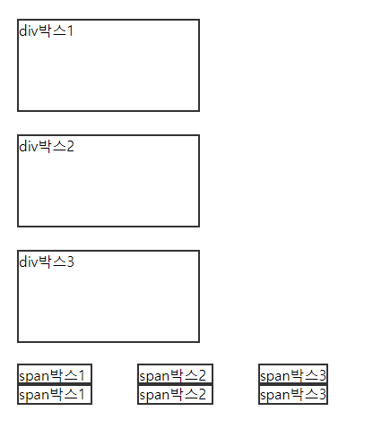
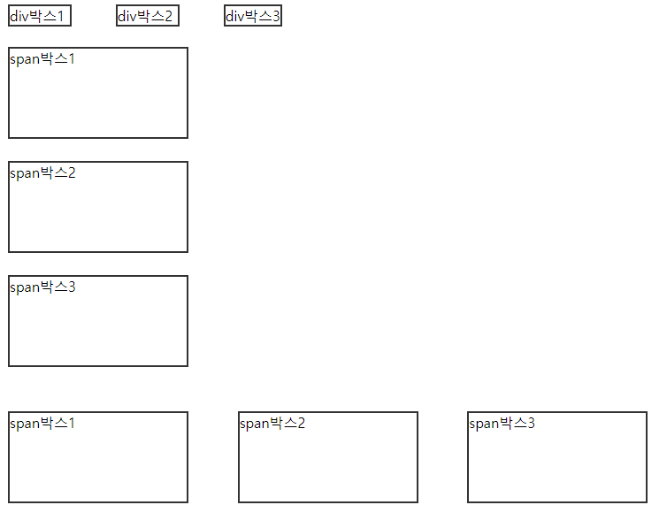
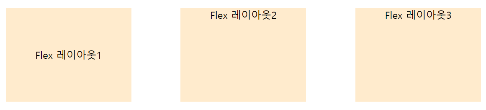
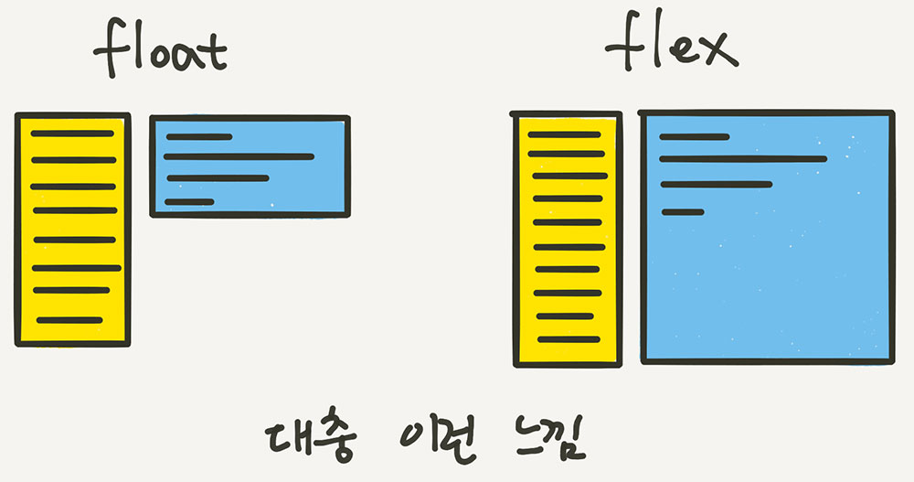
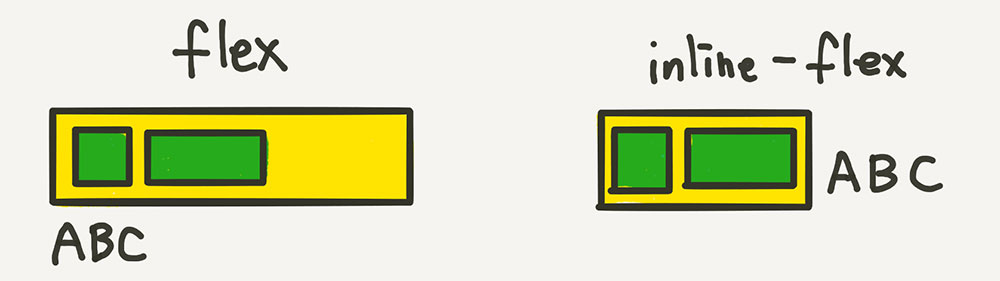
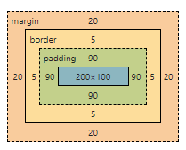
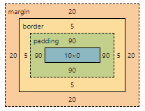

# 출력 관련 속성

- display, visibility, opacity, width, height, overflow, margin, padding, border 등
- 모든 속성에 `initial`(초기값), `inherit`(부모요소로부터 상속) 사용 가능

## 1. display 속성

- 화면 출력 모드를 지정하는 속성
- 태그마다 화면 출력 모드가 `block, inline, inline-block` 등으로 구성

### 🍑 **block 속성**

- `div, h1~h6, p, section, article, header, footer` 등
- 요소의 특징 : 자동으로 다음 줄에 배치가 되며, 크기와 관련된 속성을 지정할 수 있음
- 부여 가능한 속성의 값 : `inline | block | inline-block | none`
- 부여 가능한 속성의 값2 : `contents, flex, grid, box, table, inline-flex, inline-grid, inline-table, list-item, run-in, table-caption, table-column, table-row, table-cell, table-header-group, table-foote-group, table-column-group, table-row-group 등`

### 🍑 **inline 속성**

- `span, a, strong, em, ins` 등
- 요소의 특징 : 한 줄 안에 자동 줄바꿈이 될 때까지 배치되며, 크기 지정을 할 수 없어 `width, height, line-height, text-indent, text-align, padding-top, padding-bottom, margin-top, margin-bottom` 등의 속성을 지정한다고 하더라도 결과에 반영되지 못함
    
    ```html
    <div id="area">
        <section class="con inline">
            <div class="box"> div박스1 </div>
            <div class="box"> div박스2 </div>
            <div class="box"> div박스3 </div>
        </section>
        <section class="con block">
            <span class="box"> span박스1 </span>
            <span class="box"> span박스2 </span>
            <span class="box"> span박스3 </span>
        </section>
        <section class="con inlineblock">
            <span class="box"> span박스1 </span>
            <span class="box"> span박스2 </span>
            <span class="box"> span박스3 </span>
        </section>
    </div>
    ```
    
    ```css
    /* 기본 화면 출력 모드 */
    .box {
          width: 200px;
          height: 100px;
          margin: 25px;
          border: 2px solid #333;
      }
    ```
    
    
    
    ```css
    /* display 속성 적용 이후 */
    .box {
        width: 200px;
        height: 100px;
        margin: 25px;
        border: 2px solid #333;
    }
    .inline .box {
        display: inline;
    }
    .block .box {
        display: block;
    }
    .inlineblock .box {
        display: inline-block;
    }
    ```
    
    
    

### 🍑 flex 속성

- 레이아웃 배치 전용 기능으로 고안됨
- float와 inline-block 등을 이용한 기존 방식보다 훨씬 강력하고 편리한 기능들이 많음
    
    ```html
    <div class="container">
        <div class="item"> Flex 레이아웃1 </div>
        <div class="item"> Flex 레이아웃2 </div>
        <div class="item"> Flex 레이아웃3 </div>
    </div>
    ```
    
    
    
- Flex 아이템들은 가로 방향으로 배치되고, 자신이 가진 내용물의 `width` 만큼만 차지
    
    ```html
    <style>
        .container {
            display: flex;
        }
        .item {
            width: 200px;
            text-align: center;
            background-color: blanchedalmond;
            margin: 20px auto;
        }
        .item:first-child {
            height: 150px;
            line-height: 150px;
        }
    </style>
    ```
    
    
    
    첫 번째 아이템만 height를 주었음에도 나머지 두 개의 아이템에 모두 적용됨
    
    - `float:left;`와 `display:flex;`의 차이점
        
        
        
    - `inline-flex`
        - `block`과 `inline-block`의 관계와 같음
            
            
            
        
        ---
        
        - ⭐ **참고자료**
            
            [이번에야말로 CSS Flex를 익혀보자]()
            

## 2. visibility (가시속성)

- 보일지 보이지 않을지를 나타내는 속성
- `visible | hidden | collapse`
- **`display:none`과 `visible:hidden`의 차이점**
    - `display:none` ⇒ 출력하지 않기 때문에 영역을 차지하지 못함
    - `visible:hidden` ⇒ 출력하기 때문에 영역을 차지하지만 보이지는 않음

## 3. opacity (불투명도속성)

- 불투명 정도를 나타내는 속성
- 0~1까지의 실수 또는 정수로 표시
- **0** : 투명 / **1** : 불투명
- 해당 요소의 글자와 배경색/배경이미지를 포함한 모든 콘텐츠를 불투명 또는 투명하게 지정할 수 있음
    - 단, 배경과 글자 모두 투명하게 만들어버림

## 4. width (너비속성) | height (높이속성)

- 가로(폭=너비) 또는 세로(높이)의 크기를 지정하는 속성
- `auto | length | %`
- `length`는 `px, pt, pc, cm, mm, in, vw, vmin, vmax` 등의 단위로 지정 가능

## 5. overflow (흘러넘침속성)

- 콘텐츠의 양이 지정한 크기(폭/높이) 보다 더 클 경우 지정
- visible | hidden | scroll | auto | clip
- 세부 속성 : `overflow-x`(가로만 적용하고 싶을 때), `overflow-y`(세로만 적용하고 싶을 때)
    
    ```css
    html, body {
    		overflow: hidden;        /* 웹페이지의 스크롤 막기 */
    }
    ```
    

### 가로로 생기는 스크롤바 없애기

- 마우스 오른쪽 클릭 → 검사
    
    ```css
    html, body {
    		overflow-x: hidden;
    }
    ```
    

## 6. margin (바깥여백)

- 현재 테두리(콘텐츠) 영역의 바깥 여백으로서 여러 콘텐츠와 콘텐츠 사이의 여백
- `auto | length | %`
- `length`는 `px, pt, pc, cm, mm, in, vw, vmin, vmax` 등의 단위로 지정 가능
    
    ```css
    margin: 값;
    margin: 위/아래 좌/우;
    margin: 상 우 하 좌;
    
    margin: 30px auto;        /* 상하의 여백은 30px, 가로 가운데 정렬 */
    ```
    
- 세부 속성 : `margin-top, margin-bottom, margin-left, margin-right`
    - 통합 속성을 먼저 지정하고, 세부 속성을 나중에 지정해야 세부 속성이 적용됨

## 7. padding (안쪽여백)

- 테두리와 콘텐츠 사이의 여백
- `auto | legnth | %`
- `length`는 `px, pt, pc, cm, mm, in, vw, vmin, vmax` 등의 단위로 지정 가능
    
    ```css
    padding: 값;
    padding: 위/아래 좌/우;
    padding: 상 우 하 좌;
    ```
    
- 세부 속성 : `padding-top, padding-bottom, padding-left, padding-right`
    - 통합 속성을 먼저 지정하고 세부 속성을 나중에 지정해야 세부 속성이 적용됨
    - 지정한 폭/높이에 padding과 border 값을 더한 값이 실제 배치(적용) 크기가 됨

## 8. border (테두리)

```css
border: width style color;
ex) border: 1px solid #000;
```

- `width`
    - 선의 두께
    - `px, pt, pc, cm, mm, in, vw, vmin, vmax` 등의 단위로 지정 가능
- `style`
    - 선의 모양
    - `solid(실선), none(선이 부여되지 않음), hidden(크기는 적용되나 보이지 않음), dotted(둥근 점선), dashed(사각 점선), double(겹선), groove(음각/입체선), ridge(양각/입체선), inset(입체선), outset(입체선)` 등의 지정이 가능
- `color`
    - 선의 색
    - `컬러명, 16진(hex) 코드, rgb()/rgba(), hsl()/hsla()` 등으로 지정이 가능

### **🍊 카테고리별 세부 속성**

- border-width (선두께)
- border-style (선종류)
- border-color (선색상)

### **🍊 방향별 세부 속성**

- border-left (왼쪽 테두리)
- border-right (오른쪽 테두리)
- border-top (위쪽 테두리)
- border-bottom (아래쪽 테두리)

### **🍊 세세 속성**

- `border-left-width, border-left-style, border-left-color`
- `border-right-width, border-right-style, border-right-color`
- `border-top-width, border-top-style, border-top-color`
- `border-bottom-width, border-bottom-style, border-bottom-color`
- 각 방향별로 선두께, 선종류, 선색상을 개별적으로 지정할 수 있음

## 9. box-sizing (박스의 크기산정방법)

- 박스의 크기를 지정한 너비/높이가 콘텐츠까지만 할지, `padding`과 `border`를 포함하여 적용할지 등의 여부를 지정
- `content-box | border-box`
    - `content-box` : 지정한 너비/높이가 콘텐츠에만 적용
    - `border-box`: 지정한 너비/높이에 콘텐츠의 크기 + `padding` + `border`로 적용됨

```css
.box {
    width: 200px;
    height: 100px;
}

.box.size {
    padding: 90px;
    margin: 20px;
    border: 5px solid #333;
}
.box.size:first-of-type {
    box-sizing: content-box;
}
.box.size:nth-of-type(2) {
    box-sizing: border-box;
}
```

```html
<div id="area">
		<div class="box size"> 박스크기1 </div>
		<div class="box size"> 박스크기2 </div>
</div>
```




## 10. border-radius(테두리둥글기)

- 값으로는 `px, pt, pc, cm, mm, in, vw, vmin, vmax` 등의 단위로 지정 가능
    
    ```css
    border-radius: 20px;
    border-radius: 50%;            /* 타원 모양 */
    border-radius: 20px 50px;
    border-radius: 10px 20px 30px 40px;
    border-radius: 2em / 5em;
    
    border-top-left-radius: 20px;
    border-top-right-radius: 20px;
    border-bottom-right-radius: 20px;
    border-bottom-left-radius: 20px;
    ```