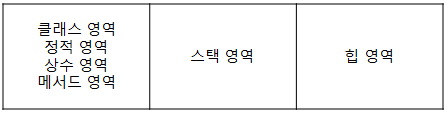
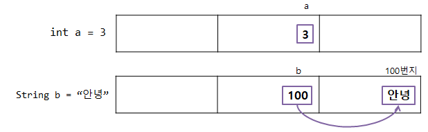

# 1. 자바의 메모리 구조

- 메모리는 목적에 따라 크게 3가지 영역으로 나뉨
    - 클래스(class) 영역 / 정적(static) 영역 / 상수(final) 영역 / 메서드(method) 영역
    - 스택(stack) 영역 : 변수들이 저장되는 공간
    - 힙(heap) 영역 : 객체들이 저장되는 공간
    
    
    

---

# 2. 기본 자료형과 참조 자료형의 차이

## 1️⃣ 자료형 자체의 이름 규칙

- 기본 자료형 8개의 이름은 모두 소문자(`int`, `long`, `float`, `double`, `…`)로 시작
- 참조 자료형의 이름은 모두 대문자(`String`, `System`, `…`)로 시작
- 권장 사항이므로 직접 생성하는 참조 자료형 이름이 소문자로 시작해도 오류는 발생하지 않으나 웬만하면 꼭 지켜야 함

## 2️⃣ 실제 데이터값의 저장 위치

- 기본 자료형과 참조 자료형 모두 변수의 공간이 스택 메모리에 생성되지만, 그 공간에 저장되는 값의 의미가 서로 다름
- 기본 자료형은 스택 메모리에 생성된 공간에 실제 변숫값을 저장
- 참조 자료형은 실제 데이터값은 힙 메모리에 저장하고, 스택 메모리의 변수 공간에는 실제 변수값이 저장된 힙 메모리의 위칫값을 저장
    
    
    

---

# 3. 자바 기본(Primitive) 타입 표현 범위

| boolean | 논리 자료형 | 1byte |  |
| --- | --- | --- | --- |
| byte | 정수 자료형 | 1byte | -128 ~ 127 |
| char | 문자 자료형 | 2byte | 0 ~ 65,535 |
| short | 정수 자료형 | 2byte | -32,768 ~ 32,767 |
| int | 정수 자료형 | 4byte | -2,147,483,648 ~ 2,147,483,647 |
| long | 정수 자료형 | 8byte | -263 ~ (263 - 1) |
| float | 실수 자료형 | 4byte | (3.4 X 10^-38) ~ (3.4 X 10^38) |
| double | 실수 자료형 | 8byte | (1.7 X 10^-308) ~ (1.7 X 10^308) |

### `long`

- 숫자 끝에 ‘L’자를 작성하면 8byte가 됨
- 따라서, 대입하는 숫자 값이 int 자료형의 최대 값인 2,147,483,647보다 크다면 값 뒤에 ‘L’ 접미사를 붙여주어야 함

### `float`

- 실수 리터럴은 기본적으로 `double`로 인식
- 따라서, `'f'`를 붙여주어 실수형임을 알려주어야 함

### `double`

- 기본 8byte이기 때문에 ‘f’ 안 붙여도 됨
- 정밀성을 높이기 위해 사용 (ex. 좌표값)
- 많이 사용하면 저장 공간을 많이 차지하게 됨 (속도 저하 ⇒ 품질 저하)

## 🍋 오버플로우 VS 언더플로우

- 기본 타입은 표현 범위가 있어서 벗어나면 오류를 발생시킴

- 오버플로우 : 해당 타입이 표현할 수 있는 ‘최대 표현 범위’보다 큰 수를 저장할 때 발생하는 현상

- 언더플로우 : 해당 타입이 표현할 수 있는 ‘최소 표현 범위’보다 작은 수를 저장할 때 발생하는 현상

---

# 5. 진법 변환 방법

- 10진수 : `숫자`
- 2진수 : `0b + 숫자`
- 8진수 : `0 + 숫자`
- 16진수 : `0x + 숫자`
    
    ```java
    int data = 10;
    
    // 10진수 정수 -> 2진수 / 8진수 / 16진수 문자열
    Integer.toBinaryString(data);    // 1010 : 10진수 -> 2진수
    Integer.toOctalString(data);     // 12 : 10진수 -> 8진수
    Integer.toHexString(data);       // a : 10진수 -> 16진수
    
    // 2진수 / 8진수 / 16진수 -> 10진수 정수
    Integer.parseInt("1010", 2);     // 10: 2진수 -> 10진수
    Integer.parseInt("12", 8);       // 10: 8진수 -> 10진수
    Integer.parseInt("a", 16);       // 10: 16진수 -> 10진수
    ```
    

---

# 6. Wrapper class

- 기본 타입의 데이터를 객체로 취급해야 하는 경우 사용
    - 메소드의 인수로 객체 타입만이 요구되면 기본 타입의 데이터를 그대로 사용할 수 없음
    
    | 기본 타입 | 래퍼 클래스 |
    | --- | --- |
    | byte | Byte |
    | short | Short |
    | int | Integer |
    | long | Long |
    | float | Float |
    | double | Double |
    | char | Character |
    | boolean | Boolean |

### 🍇 박싱(Boxing)

- 기본 타입 ⇒ 래퍼 클래스

### 🍇 언박싱(UnBoxing)

- 래퍼 클래스 ⇒ 기본 타입

```java
Integer num = new Integer(17);        // 박싱
int n = num.intValue();               // 언박싱
System.out.println(n);                // 17

// Character ch = new Character('X');
Character ch = 'X';                    // 오토박싱
// char c = ch.charValue();
char c = ch;                           // 오토언박싱
System.out.println(c);                 // X
```

---

# 7. 자료형 검사

```java
int str = "1004";
System.out.println("str이 문자열형인가? " + str instanceof String);
```