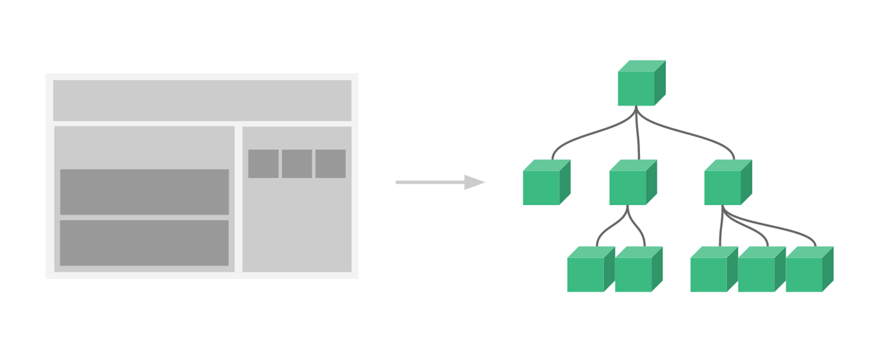

# 컴포넌트 이해하기

## 학습목표


이번 시간에는 일반 HTML로 작성된 문서를 Vue로 변환해가며 컴포넌트를 사용하면 어떤점이 좋은지 알아보도록 하겠습니다.

- 컴포넌트란 무엇인가? (What)
- 컴포넌트를 왜 사용하는가? (Why)
- 컴포넌트를 어떻게 사용하는가? (How)
    - `컴포넌트 정의` → `컴포넌트 등록` → `컴포넌트 사용`
- 컴포넌트 시스템이란?

## 컴포넌트 (Component)


자바스크립트에서 재사용할 수 있도록 코드를 분리한 파일을 **모듈**이라고 하는데요. Vue에서도 마찬가지로 **UI(HTML, CSS, JS)를 재사용할 수 있도록 정의한 것**을 **컴포넌트**라고 ****합니다.

<aside>
💡 JavaScript 코드를 재사용하는 모듈과 다르게, 컴포넌트는 JavaScript 뿐만아니라 HTML, CSS도 함께 캡슐화하여 재사용이 가능하게 합니다.

</aside>

### 컴포넌트를 사용하는 이유

- 컴포넌트를 사용하면 UI를 재사용 할 수 있습니다.
→ 프론트엔드 개발을 하다보면 JavaScript 뿐만 아니라 HTML, CSS를 반복적으로 사용할 때가 있습니다. 이런경우 컴포넌트로 캡슐화 한 후 필요한 곳에서 사용할 수 있습니다.
- 컴포넌트를 사용하여 UI를 독립적으로 나눔으로써(레이아웃 등) 코드를 클린하게 할 수 있습니다.
→ 프론트엔드 개발을 하다보면 코드가 길어져 유지보수가 힘들 수 있습니다. 이런경우 컴포넌트로 독립적으로 분리함으로써 코드를 클린하게 하여 유지보수를 보다 쉽게할 수 있습니다.

### 컴포넌트 만들기

컴포넌트를 만들고 사용하는 단계를 3가지 단계로 나누고 간단히 설명해보도록 하겠습니다.

`컴포넌트 정의` → `컴포넌트 등록` → `컴포넌트 사용`

## 컴포넌트 정의


컴포넌트 **어떤 방법으로 정의** 하느냐에 따라 `문자열 템플릿`, `Single File Component` 두 가지 방법이 있습니다.

### **문자열 템플릿 (string** template**)**

```jsx
// BookComponent.js 파일
export default {
  data() {
    return {
      subtitle: '도서명'
    }
  },
  template: `
    <article class="book">
      <div class="book__subtitle">{{ subtitle }}</div>
      <div class="book__title">
        HTML 강좌
      </div>
    </article>
  `
}
```

### **Single File Component (SFC)**

자바스크립트로 복잡한 프로젝트를 개발한다면 다음과 같은 어려움이 존재한다.

- **문자열 템플릿**은 가독성이 떨어지고 예쁘지 않습니다.
- `.js` 는 HTML과 JavaScript는 모듈화 할 수있지만 CSS는 빠져있습니다.
- 또 다른 문제점은 [공식문서](https://v3.ko.vuejs.org/guide/single-file-component.html#%E1%84%89%E1%85%A9%E1%84%80%E1%85%A2)에서 확인 가능합니다.

이 모든 문제는를 해결하기 위해 Vue.js는 Webpack, Browserify, Vite와 같은 빌드 도구를 활용하여 `.vue` 확장자를 가진 `Single File Component(SFC)`를 사용합니다.

SFC는 `template`, `script`, `style` 크게 세 가지로 구성되어 있습니다.

```jsx
// BookComponent.vue 파일
<template>
  <article class="book">
    <div class="book__subtitle">{{ subtitle }}</div>
    <div class="book__title">
      HTML 강좌
    </div>
  </article>  
</template>

<script>
export default {
  data() {
    return {
      subtitle: '도서명'
    }
  },
}
</script>

<style scoped>
</style>
```

<aside>
💡 실무에서는 `문자열 템플릿` 대신 `Single File Component`를 사용하고 있습니다.

</aside>

### 컴포넌트 등록

컴포넌트를 **어디에서 사용하냐**에 따라 두 가지 등록 방법이 있습니다.

- **전역 등록 (Global Registration)**
    
    `app.component`를 이용해서 컴포넌트를 등록하면, 컴포넌트는 애플리케이션 **전역 등록**이 되어 모든 컴포넌트 인스턴스의 템플릿 내부에서 사용할 수 있습니다.
    
    ```jsx
    const app = createApp({ ... })
    app.component('BookComponent', BookComponent)
    ```
    
- **지역 등록 (Local Registration)**
    
    전역 등록은 보통 이상적이지 않습니다. 예를 들어 Webpack과 같은 빌드 시스템을 사용하는 경우 컴포넌트를 전역 등록 하게 되면 컴포넌트를 사용하지 않더라도 계속해서 최종 빌드에 해당 컴포넌트가 포함되는 것을 의미합니다. 이는 사용자가 다운로드하는 자바스크립트 파일의 크기를 불필요하게 증가시킵니다.
    
    Vue 인스턴스의 `components` 속성 안에 정의 하세요. 그러면 해당 Vue 인스턴스에서 지역 등록된 컴포넌트를 사용할 수 있습니다.
    
    ```jsx
    const app = createApp({
    	components: {
    		BookComponent: BookComponent
    	}
    })
    ```
    

### 컴포넌트 사용

컴포넌트는 `template`에서 사용할 수 있습니다.

```jsx
<BookComponent></BookComponent>
<book-component></book-component> 
```

- `PascalCase`로 등록 된 컴포넌트는 `PascalCase`, `kebab-cased` 둘 다 사용 가능합니다.
- kebab-cased로 등록 된 컴포넌트는 `kebab-cased` 로만 사용 가능합니다.

> **컴포넌트 네이밍 룰**
> 

컴포넌트를 사용할 때 `PascalCased`를 권장합니다. `PascalCased`를 사용하면 다음과 같은 이점이 있습니다.

1. `PascalCased` 이름은 유효한 JavaScript 식별자입니다. 이렇게 하면 JavaScript에서 구성 요소를 더 쉽게 가져오고 등록할 수 있습니다. IDE의 자동 완성 기능도 지원합니다.
2. `<PascalCase />`이것은 템플릿의 기본 HTML 요소가 아닌 Vue 구성 요소라는 것을 더 분명하게 만듭니다. 또한 Vue 구성 요소를 사용자 정의 요소(웹 구성 요소)와 구별합니다.

`SFC`, `string template` 에서 `PascalCase`를 사용 가능하며 `DOM Template`에서는 `kebab-case`를 사용해야 합니다.

[Component Registration | Vue.js](https://vuejs.org/guide/components/registration.html)

## 컴포넌트 시스템

컴포넌트 시스템은 Vue의 또 다른 중요한 개념입니다. 이는 작고 독립적이며 재사용할 수 있는 컴포넌트로 구성된 대규모 애플리케이션을 구축할 수 있게 해주는 추상적 개념입니다. 생각해보면 거의 모든 유형의 애플리케이션 인터페이스를 컴포넌트 트리로 추상화할 수 있습니다.

- 작은 의미 재사용 가능한 컴포넌트
- 넓은 의미 모든 Vue 인스턴스는 컴포넌트이다.

쉽게 말해서 Vue는 컴포넌트로 구서된 애플리케이션이다 라고 보셔도 될 만큼 중요하다라는 뜻입니다. ^^

